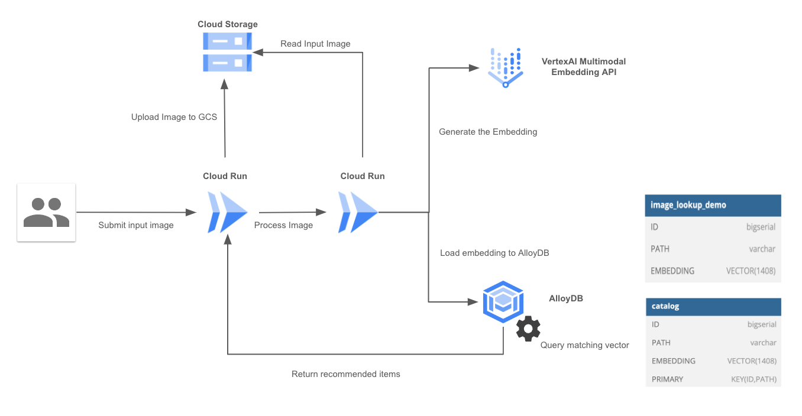

# fashion-item-recommendation

Note: This project is for demonstration only and is not an officially supported Google product.

# Introduction

This demo showcases a Fashion Item Recommendation based on image simalarity search. The application provides an user interface to upload an image and get recomended items from your catalog. The code provided here is designed to show how you can combine GenAI, VertexAI and AlloyDB to provide advanced search capabilities to your application.

# Architecture

The diagram show the architecture of the demo

# Deploying

Deploying this demo consists of 3 steps:

[Setting up your Database](docs/alloydb.md) -- creating your database and initializing it with data
Deploying your service -- deploying your retrieval service and connecting it to your database
Running the LLM-based application -- running your application locally

Before you begin
Clone this repo to your local machine:

git clone https://github.com/GoogleCloudPlatform/genai-databases-retrieval-app.git
Setting up your Database
The retrieval service uses an interchangeable 'datastore' interface. Choose one of any of the database's listed below to set up and initialize your database:

Set up and configure AlloyDB
Set up and configure Cloud SQL
Deploying the Retrieval Service
Instructions for deploying the retrieval service

Running the LLM-based Application
Instructions for running app locally

Clean up Resources
Instructions for cleaning up resources

